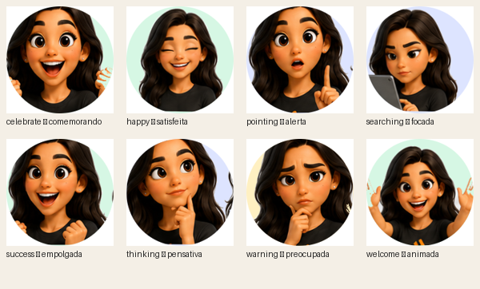
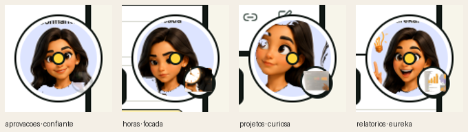

# Nathal.IA — Avatar 2D Expressivo (Fase 9)

> Avatar 2D que **troca entre expressões reais ilustradas** conforme o **estado**
> da assistente e a **tela** atual, com micro-movimento idle. Implementado como
> componente real e ligado ao `nathaliaStore`. Sem WebGL, SSR-safe, reduced-motion.
>
> Data: 2026-06-18.

## Biblioteca de expressões

Recortadas das folhas de referência (em `docs/nathalia/expressions/_raw/sheet_*.png`)
**centradas no rosto** (recorte quadrado por célula do grid, centrado na face, com
fundo removido) — assim o launcher de 88px enquadra o rosto e adereços flutuantes
(ex.: lâmpada do "eureka") ficam fora do quadro. Servidas em `/nathalia/expressions/*.png`.

- **17 expressões**: preocupada, alerta, comemorando, empolgada, pensativa,
  curiosa, surpresa, confiante, satisfeita, grata, animada, triste, zangada,
  focada, eureka, duvida, encorajando.
- **12 visemas de fala** (`vis-a … vis-rest`): para **lip-sync futuro** (boca por
  fonema). Ainda **não** usados em runtime.
- **4 objetos por tela** (`icon-horas/projetos/aprovacoes/relatorios`): relógio,
  quadro, carimbo e gráfico, recortados dos **cards de capacidade** do
  `Avatar_NathIA.png` (a idealização "Horas tem um relógio", etc.).

## Objetos por tela

Cada tela com objeto idealizado mostra um **badge** (disco branco no canto
inferior direito do avatar) com o objeto: **Horas→relógio, Projetos→quadro,
Aprovações→carimbo, Relatórios→gráfico** (`objectForContext` em
`nathaliaExpressions.ts`). O badge fica fora do círculo recortado (wrapper não
clipado) e some em avatares muito pequenos (`size < 44`).

Reprocessar: o script de recorte/limpeza está embutido no histórico desta fase
(Pillow: crop por linha do grid + flood-fill de fundo a partir das bordas).

## Componente

- **`NathaliaAvatar2DExpr`** (`packages/character-nathalia/src/NathaliaAvatar2DExpr.tsx`):
  disco/anel por intenção + `` da expressão com **crossfade** + idle
  (breathe/sway), framing por `viewMode` (bubble/panel/lab). Pré-carrega o
  conjunto alcançável para não “piscar” na troca.
- **`nathaliaExpressions.ts`**: mapa puro `estado/contexto → expressão` e URLs.
- **Integração:** `NathaliaAvatar` usa o avatar expressivo no caminho 2D quando
  `isExpressive2DEnabled()` (ligado por padrão; desligue com
  `NEXT_PUBLIC_NATHALIA_2D_EXPR=false` para voltar ao SVG). O `NathaliaWidget` e o
  `NathaliaChatPanel` passam o `context` atual.
- **Precedência sobre 3D:** o 2D expressivo **vence a flag auto-3D**
  (`NEXT_PUBLIC_ENABLE_NATHALIA_3D`) — o widget/painel sempre mostram o rosto
  ilustrado. O 3D só aparece com `variant="3d"` explícito (o **Lab** é o testbed
  3D). Para usar 3D no widget, defina `NEXT_PUBLIC_NATHALIA_2D_EXPR=false`.

## Mapeamento

**Estado ativo vence; senão usa a expressão de repouso da tela.** Por isso a cara
muda tanto ao **navegar** quanto ao **interagir**.

| Estado | Expressão | | Tela (repouso) | Expressão |
| --- | --- | --- | --- | --- |
| welcome | animada | | general/home | animada |
| listening | curiosa | | dashboard | confiante |
| thinking | pensativa | | hours / expenses | focada |
| searching | focada | | projects | curiosa |
| pointing | alerta | | clients | grata |
| happy | satisfeita | | consultants | encorajando |
| success | empolgada | | approvals | confiante |
| celebrate | comemorando | | reports | eureka |
| warning | preocupada | | finance | pensativa |
| error | triste | | settings | alerta |

Sobram livres para overrides: surpresa, grata, zangada, duvida, eureka, satisfeita…

## Validação ao vivo

Capturado no app (login dev, 2D padrão). **Cada estado troca a expressão de fato**
e a **navegação** muda a cara por tela (launcher fixo no canto, dentro da viewport):

Launcher por tela (rosto centrado + **badge do objeto** no canto):

- Estados → `welcome→animada`, `thinking→pensativa`, `success→empolgada`,
  `warning→preocupada`, `celebrate→comemorando`, `pointing→alerta`, etc. ✅
- Telas (launcher) → `horas→focada` (+relógio), `projetos→curiosa` (+quadro),
  `aprovações→confiante` (+carimbo), `relatórios→eureka` (+gráfico). ✅
- Capturas: [`audit-screenshots/v03-eval/2d/live/`](./audit-screenshots/v03-eval/2d/live/).
- Script repetível: `scripts/nathalia/capture_expr_live.mjs`.

## Qualidade

`typecheck` ✅ · `lint` ✅ · testes: sem regressão desta mudança (as 2 falhas em
`placement.test.tsx` — "document is not defined" — **já ocorrem com o avatar
desligado**, é quirk de ambiente desta máquina, não desta feature).

## Refinamentos aplicados (Fase 9.4)

- **Lip-sync preciso (por fonema)** — o provider de voz dirige a boca pelo **áudio
  real**: cada caractere vira um visema (`visemeForChar`, pt-BR) e a posição
  **resincroniza nas fronteiras de palavra** (`onboundary`). O store ganhou
  `viseme`; o avatar usa o visema do áudio quando há, e cai no loop cíclico só
  quando não há dados de fronteira. Bem mais casado com a fala que a sequência fixa.
- **Seam de voz externa** — `NathaliaVoiceProvider` + `setNathaliaVoiceProvider()`:
  trocar para uma voz **natural** (Azure Neural / ElevenLabs / OpenAI…) é plugar
  um provider, sem mexer no avatar/lip-sync/mudo. Guia completo (recomendação +
  arquitetura) em [`VOICE.md`](./VOICE.md).

## Refinamentos aplicados (Fase 9.3)

- **Cor (definitivo)** — a perda de cor persistia no **cabelo/olhos** porque o
  recorte centrado no rosto colocava o cabelo na borda e a *seed* do flood-fill
  caía **dentro do cabelo**, comendo-o. Corrigido: o fundo é removido **na folha
  inteira primeiro** (seeds só na borda da folha = fundo garantido) e só **depois**
  os rostos são recortados. Auditado sobre magenta: cabelo sólido, olhos intactos. ✅
- **Voz (TTS)** — `nathaliaSpeech.ts` usa a Web Speech API (grátis, **pt-BR**):
  `voiceNathalia(text)` é chamado quando a Nathal responde (no `NathaliaProvider`),
  fala em voz alta e **dirige o lip-sync pelo áudio real** (`onstart`/`onend`).
  Sempre há um lip-sync por **timer** como base (a boca mexe mesmo mudo/sem voz
  instalada/headless). **Botão de mudo** no header do painel (`Volume2`/`VolumeX`,
  persistido em `localStorage`). Verificado: botão presente, lip-sync 16/16 quadros.

## Refinamentos aplicados (Fase 9.2)

- **Cor preservada** — o recorte de fundo (flood-fill) estava vazando para
  dentro do cabelo/dentes/roupa (threshold 50 → buracos brancos). Refeito com
  threshold conservador (30) → sem perda de cor; faces limpas (auditado sobre
  fundo azul). ✅
- **Feições positivas / adequadas ao momento** — `warning→alerta` (atenta, não
  preocupada), `error→encorajando` ("vamos resolver juntos"); todas as telas
  descansam em expressões positivas (settings/finance→`confiante`).
  `triste/zangada/preocupada/duvida` **não** são auto-usadas (só override). ✅
- **Tours mostram o componente a clicar** — cada passo agora **navega para a
  tela certa** e **destaca o componente real** (outline azul) com instrução de
  clique: Horas → setas de período → "Novo lançamento" → grade → status;
  Aprovações → fila → "Aprovar/Reprovar". Os componentes ganharam `id`s
  (`horas-periodo/novo/grade/status`, `aprovacoes-fila/acoes`); o `NathaliaTour`
  re-tenta achar o elemento (render assíncrono pós-navegação). ✅

## Refinamentos aplicados (Fase 9.1)

- **Framing centrado no rosto** — assets recortados como quadrados centrados na
  face (§ "Biblioteca"). ✅
- **Lip-sync** — `NathaliaAvatar2DExpr` cicla os 12 visemas (`VISEME_SEQUENCE`,
  ~110ms/quadro) enquanto a Nathal "fala". A store marca `speaking` ao dizer uma
  fala (`sayNathalia` role `nathalia` → `startNathaliaSpeaking`, duração
  ≈ `len*42ms`, teto 3,5s); o painel passa `speaking` ao avatar. Respeita
  `prefers-reduced-motion` (sem lip-sync). Verificado ao vivo: a boca percorre
  `vis-rest/a/e/o/m/i/u/s/tdn…` durante a resposta. _Obs.: respostas que navegam/
  abrem tour fecham o painel, então o lip-sync ali é breve._ ✅
- **WebP** — todos os assets convertidos PNG→WebP (**949 KB → 196 KB, ~-80%**);
  URLs `.webp` (a troca de extensão também evita cache antigo). Fontes `.png`
  ficam em `docs/nathalia/expressions/` (lossless). ✅

## Próximos passos (opcionais)

1. Cutouts mais limpos do **carimbo/quadro** (mão oclui na arte original).
2. **Mapear estados negativos extras** (zangada/duvida) a fluxos específicos.
3. Curva de visemas guiada pelo texto real (em vez de sequência fixa).
