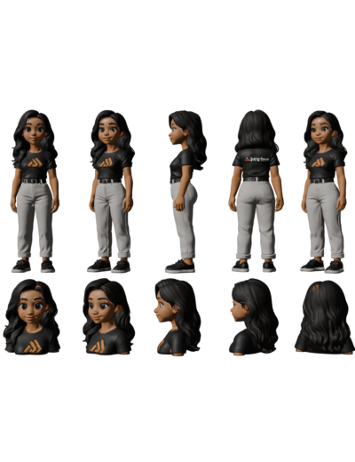
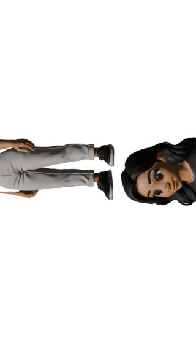
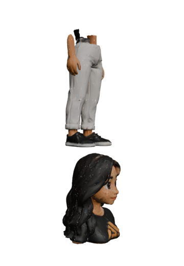
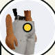
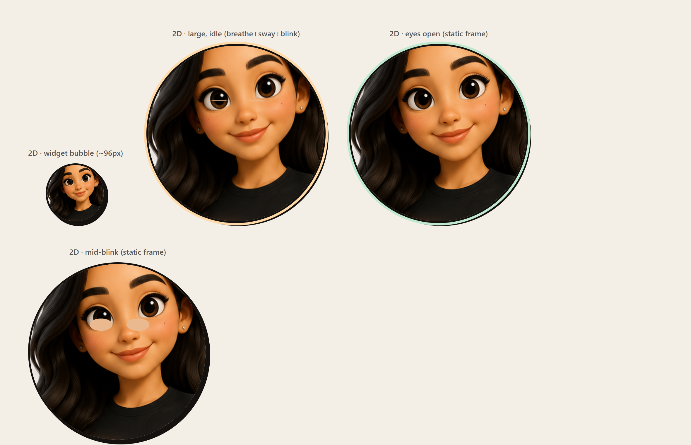
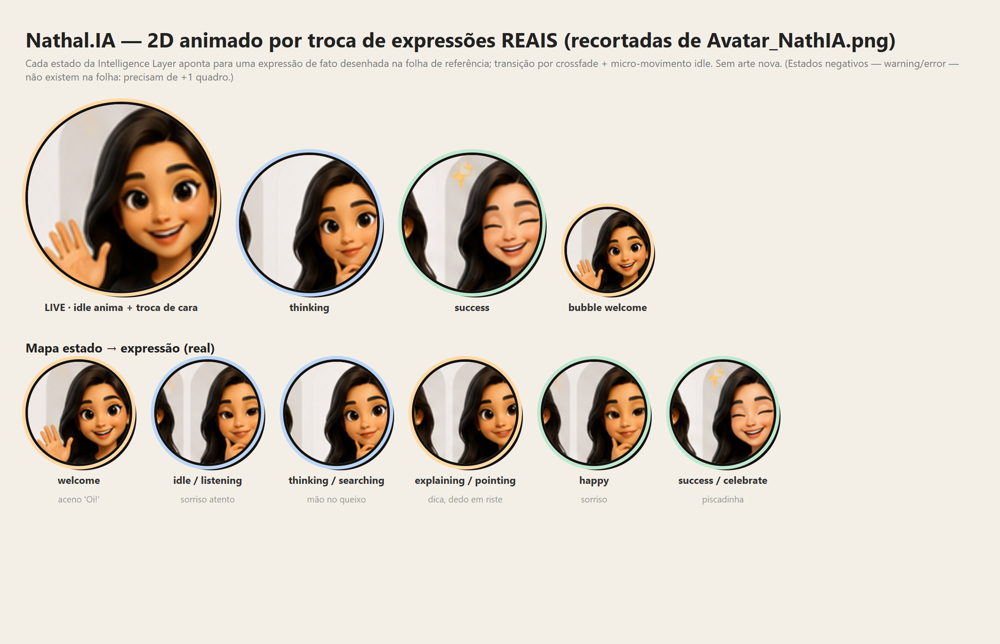

# Nathal.IA — Avaliação do `nathalia_tripo_v03.glb` + Comparação 2D × 3D

> **Pergunta:** o `packages/character-nathalia/assets/raw/nathalia_tripo_v03.glb`
> (mais próximo de `Avatar_NathIA.png`) é utilizável? Se não, torná-lo utilizável
> e demonstrar o resultado, comparando **animar um 2D a partir do PNG** versus
> **usar o modelo 3D**.
>
> **Data:** 2026-06-18. Evidências (renders/screenshots) em
> [`audit-screenshots/v03-eval/`](./audit-screenshots/v03-eval/). Ferramentas:
> Blender 5.1 (headless), Playwright/Chrome, Pillow.

---

## 1. Veredito

| | Resultado |
| --- | --- |
| **Raw v03 utilizável como está?** | ❌ **Não.** 52,5 MB, **1,85 M triângulos**, sem rig/anim/shape keys, e — crítico — **não é um personagem único: é uma folha de turnaround 3D** (5 poses de corpo inteiro + uma fileira de bustos de expressão, tudo numa malha só). |
| **Dá para torná-lo utilizável?** | ✅ **Sim, e foi feito.** Isolei a figura-herói da "sopa", reduzi e otimizei → **`master_v3_tripo_preview.glb` — 289 KB, 24 000 tris, Draco**, dentro do orçamento web (≤1,5 MB), virado para `-Y`, ~1,6 m. **Carrega e renderiza em 3D no app.** |
| **Limitação que permanece** | O modelo é **estático** (sem rig/shape keys/blink) e tem **proporções realistas** que **não casam com o enquadramento "bubble" atual** (calibrado para o boneco chibi de cabeça grande). |
| **Recomendação** | Para o **widget/bubble**, o caminho **2D-a-partir-do-PNG** entrega hoje mais fidelidade, enquadramento e custo melhores. O **3D Tripo** vale como **vitrine no Lab/painel** e como base futura **se** receber rig + re-enquadramento. Ver §6. |

---

## 2. Diagnóstico do raw v03

Medições (Blender):

- **52,5 MB**, 1 objeto / 1 malha / 1 material, **3 texturas 1024²** (basecolor, normal, roughness-metallic).
- **1 847 223 triângulos**, 1 002 702 vértices. **Sem rig, sem animações, sem shape keys.**
- **Conteúdo real:** ao renderizar de 6 direções, o arquivo é a **reconstrução 3D da folha inteira** `Avatar_NathIA.png` — ~5 figuras de corpo (front, 3/4, perfil, costas, 3/4) + uma fileira de bustos. Separando por *loose parts* → **1280 ilhas** desconexas (não há "1 ilha = 1 figura"; cada figura é centenas de cascas).



**Conclusão:** ótima *likeness* (é exatamente o look da referência), mas inutilizável
diretamente — ~35× acima do orçamento, malha massiva, múltiplas figuras, e sem
nada do que o runtime espera (rig/shape keys/clipes).

---

## 3. Como foi tornado utilizável

Pipeline (script reprodutível: [`scripts/nathalia/blender/build_v03_tripo.py`](../../scripts/nathalia/blender/build_v03_tripo.py)):

1. **Mapeei o layout** — as ilhas formam 5 colunas (eixo Y) = as 5 poses; altura = Z; rosto aponta +X.
2. **Isolei a figura-herói** (coluna frontal) por **recorte espacial** (fatia Y + teto Z abaixo do "vão do pescoço"), descartando as outras poses e os bustos. (Flood-fill por conectividade **não** funciona: a malha fragmenta no quadril/pescoço.)
3. **Juntei** as ~197 cascas numa malha; **orientei** para virar `-Y` (contrato), centralizei e escalei para ~1,6 m, pés na origem.
4. **Decimei** 277 k → **24 000 tris** (Decimate collapse).
5. **Otimizei texturas**: basecolor 768², normal/rm 256².
6. **Exportei com Draco** → **`master_v3_tripo_preview.glb` (289 KB)**, sincronizado para `apps/web/public/nathalia/`.

**Resultado (renders Blender):**

| Frente | 3/4 |
| --- | --- |
|  |  |

Cabelo escuro ondulado, camiseta preta com **chevron laranja jumpflow**, calça
clara, tênis escuros, rosto expressivo — **muito mais próximo da referência** que
o modelo paramétrico atual. A decimação deixou leves *speckles* (artefato de
*scan* + normal map em baixa resolução), políveis numa próxima iteração.

---

## 4. Estado no app (3D ligado)

Com `NEXT_PUBLIC_ENABLE_NATHALIA_3D=true` e o modelo apontado para o novo GLB, o
app **carrega e renderiza o Tripo em 3D** (5 canvases R3F no Lab; o launcher
aparece dentro da viewport — fix da Fase 8.3 confirmado). `NathaliaModel` tolera
a ausência de clipes/shape keys (cai para pose estática sem quebrar).

**Porém o enquadramento "bubble" erra o alvo:** calibrado para o chibi de cabeça
grande (~4,5 cabeças), ele mira o rosto e, na figura Tripo de **proporção
realista** (~7 cabeças), acaba enquadrando **quadril/pernas**:



Ou seja: **funciona tecnicamente**, mas precisa de **re-enquadramento por modelo**
(câmera/target/zoom) e idealmente de **rig + shape keys** para piscar/expressões —
hoje é uma estátua.

---

## 5. Comparação: 2D-a-partir-do-PNG × 3D Tripo

### 5.1 Demo 2D (construída a partir de `Avatar_NathIA.png`)

Recortei o **busto-herói** do PNG e animei com CSS: respiração (scale), leve
balanço (rotate) e **piscar** (pálpebras tom-de-pele em `scaleY`). Sem editor 3D,
sem WebGL.



No tamanho do bubble (~96px) lê **nítida, simpática e on-brand** — é literalmente
a arte da referência. O enquadramento circular (rosto+ombros) sai perfeito.

### 5.1.1 2D animado de verdade — troca entre expressões REAIS da folha

O `Avatar_NathIA.png` **já traz uma fileira de expressões desenhadas** ("Oi! Tudo
bem?", "Deixa eu ver…", "Resolvido!", "Entendi!", "Dica importante!"). Recortei
essas 5 expressões e montei um avatar que **faz crossfade entre as expressões
reais** conforme o estado da Intelligence Layer, com micro-movimento idle
(respiração + sway) por cima. **Nenhuma arte nova, nenhuma falsificação** — são os
rostos que o ilustrador já desenhou:



Mapeamento: `welcome→aceno` · `idle/listening→sorriso` · `thinking/searching→mão
no queixo` · `explaining/pointing→dica` · `happy→sorriso` · `success/celebrate→
piscadinha`. Demo: [`2d/expr-swap.html`](./audit-screenshots/v03-eval/2d/expr-swap.html);
recortes em [`2d/expr/`](./audit-screenshots/v03-eval/2d/expr/).

Isto entrega **movimento + troca de expressão de fato**, free, com a arte que já
existe. **Limite honesto:** a folha **não tem expressões negativas** (warning/
error) nem boca-aberta de fala — esses pedem **+1–2 quadros** de arte consistente
(ver §5.3). Uma tentativa anterior de *rig por camadas* (pálpebras desenhadas via
CSS) ficou crua — [`2d/rig.html`](./audit-screenshots/v03-eval/2d/rig.html) — e foi
superada por esta troca de expressões reais.

### 5.3 Como ir além — ferramentas free

Para completar expressões (negativas, fala) e ganhar deformação suave:

- **Gerar +N quadros de rosto consistentes** (warning, error, celebrate boca-aberta,
  visemas de fala): reusar o mesmo gerador da referência, ou local/free via
  **Stable Diffusion (SDXL) + IP-Adapter / InstantID** para manter a identidade da
  personagem. Saída = mais PNGs para o mesmo esquema de crossfade.
- **Rive** (free, runtime `.riv` minúsculo, web/React): rig com *state machine* e
  deformação por malha — ideal para avatar reativo a estado; lip-sync e olhar
  contínuos.
- **Lottie** (free; After Effects/LottieFiles → JSON leve): animações vetoriais
  declarativas disparadas por estado.
- **Live2D Cubism** (free para uso indie): rig 2.5D por camadas a partir de um PSD
  — o mais expressivo, porém exige separar a arte em camadas.

Recomendação de menor custo→maior retorno: **(1)** subir já a troca de expressões
reais (acima) → **(2)** gerar +2-3 quadros (warning/error/fala) → **(3)** se quiser
deformação contínua/lip-sync, migrar o rig para **Rive**.

### 5.2 Tabela de decisão

| Critério | **2D do PNG** | **3D Tripo (master_v3_tripo)** | Paramétrico atual (master_v3) |
| --- | --- | --- | --- |
| **Fidelidade à referência** | ★★★★★ (é a própria arte) | ★★★★☆ (likeness forte; speckles) | ★★☆☆☆ (chibi blocado) |
| **Peso** | ~250 KB PNG (→ <100 KB em WebP) | 289 KB GLB + ~600 KB libs three/draco | 266 KB GLB + libs |
| **Enquadramento no bubble** | ★★★★★ (crop perfeito) | ★★☆☆☆ (precisa re-tunar; hoje pega pernas) | ★★★★☆ (calibrado) |
| **Animação / expressões** | **Já animado com expressões REAIS** (crossfade entre os 5 rostos da folha + idle — §5.1.1); negativas/fala = +1–2 quadros (§5.3) | Potencialmente rica (rotacionar, luz, pose) **mas hoje estática** — exige rig+shape keys | Já tem 9 clipes + 10 shape keys + blink |
| **Custo p/ ficar pronto** | **Baixo** (recorte + CSS; opcional cortar olhos/boca em camadas) | **Alto** (re-enquadrar + riggar + limpar speckles + decidir expressões) | Já pronto |
| **Runtime** | Trivial (img + CSS), SSR-safe, sem WebGL | WebGL + Draco; cai p/ 2D sem GPU | idem |
| **Manutenção/novas poses** | Nova arte por pose/expressão | Reaproveita o 3D (1 modelo, N ângulos) — após riggar | Reconstrução paramétrica |

---

## 6. Recomendação

**Curto prazo (widget/bubble — o que o usuário mais vê): adotar o 2D-a-partir-do-PNG.**
Entrega hoje a fidelidade da referência, enquadramento perfeito e custo mínimo,
sem WebGL. Evolução barata: cortar olhos/sobrancelhas/boca em camadas para blink
e 2–3 expressões (welcome/thinking/success), reaproveitando os estados que a
Intelligence Layer já emite.

**Médio prazo (vitrine): manter o 3D Tripo como showpiece no Lab/painel grande**,
onde o corpo inteiro brilha e o enquadramento é folgado. Para promovê-lo ao
runtime do bubble seria preciso: (a) **re-enquadrar** (preset de câmera por
modelo, mirando o rosto da proporção realista), (b) **riggar + shape keys** para
deixar de ser estátua, (c) **limpar os speckles** da decimação. É trabalho de
arte 3D — só vale se a "presença 3D" for prioridade de produto.

**Híbrido pragmático:** 2D no bubble (sempre visível, leve), 3D no Lab/painel
expandido (quando há espaço e a pessoa optou por abrir).

> O 2D não é "desistir do 3D": é entregar a **cara certa, já**, enquanto o 3D
> amadurece. A referência é um *render* 2D de alta qualidade — usá-la diretamente
> é o atalho mais fiel que existe.

---

## 7. Como reproduzir / ligar

- **Rebuild do GLB:** `blender --background --python scripts/nathalia/blender/build_v03_tripo.py -- --apply` (consome `_v03_body.blend`, derivado de `_v03_separated.blend`).
- **Ligar o 3D Tripo no app (local):** em `apps/web/.env.local`:
  ```
  NEXT_PUBLIC_ENABLE_NATHALIA_3D=true
  NEXT_PUBLIC_NATHALIA_3D_MODEL_URL=/nathalia/master_v3_tripo_preview.glb
  ```
  (⚠️ não exportar essa URL pelo Git Bash: o MSYS converte `/nathalia/...` em
  `C:/Program Files/Git/nathalia/...`. Use arquivo `.env.local` ou `MSYS_NO_PATHCONV=1`.)
- **Demo 2D:** [`audit-screenshots/v03-eval/2d/demo.html`](./audit-screenshots/v03-eval/2d/demo.html) (recorte: `hero-bust-crop.png`).
- **Capturas:** `scripts/nathalia/capture_3d_demo.mjs`, `capture_canvas.mjs`, `capture_2d_demo.mjs`.

**Artefatos gerados:** `master_v3_tripo_preview.glb` (em `assets/models/` e
`public/nathalia/`), `master_v3_tripo.blend`, e os renders/demos em
`audit-screenshots/v03-eval/`. **Nada do pipeline paramétrico (v1/v2/v3) foi
alterado;** o default de runtime continua o `master_v3_preview.glb`.
