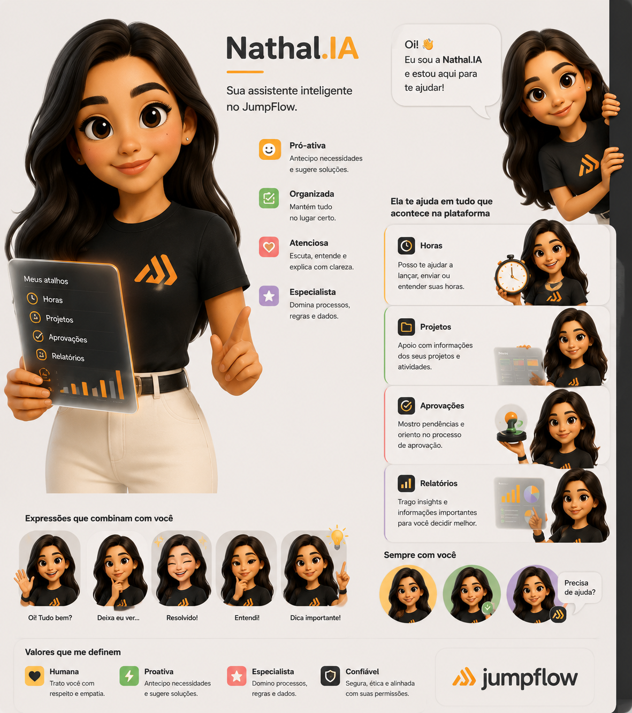

# Nathal.IA — Visual Parity Report (Fase 8.2)

> Comparação entre a **referência aprovada** `Avatar_NathIA.png`, o **estado
> atual** no app, os **ajustes feitos** nesta fase e as **limitações restantes**.
> Foco em **visibilidade, posicionamento e presença visual** — sem alterar RBAC,
> Intelligence Layer, feature flag 3D ou o GLB. **Nenhum LLM** foi introduzido.

## Referência

A direção aprovada é a folha de personagem **`Avatar_NathIA.png`**: uma jovem
3D estilo _Pixar_, amigável e profissional —

- **Rosto protagonista:** olhos grandes e expressivos (íris castanha, cílios
  marcados), sobrancelhas definidas, sorriso caloroso, bochechas levemente rosadas.
- **Cabelo:** longo, ondulado, castanho-escuro (espresso), emoldurando o rosto.
- **Roupa:** **camiseta preta** com a **marca chevron laranja da jumpflow** no peito.
- **Pele:** tom quente/bronzeado.
- **Badges “Sempre com você”:** versões circulares mostrando **rosto + ombros +
  tronco superior** sobre **discos pastel** (amarelo, verde, roxo) — é exatamente
  o enquadramento-alvo do _bubble_.

> **Local do arquivo:** coloque a imagem aprovada em
> `docs/nathalia/Avatar_NathIA.png` (referenciada por este relatório). Se já
> estiver em outro caminho, ajuste o link abaixo.
>
> 

## Comparativo: referência × antes × depois

| Dimensão | Referência | Antes (validação 8.1) | Depois (8.2) |
| --- | --- | --- | --- |
| **Aparece em todas as telas** | — | ❌ sumia em várias telas | ✅ portal em `document.body` |
| **Z-index / sobreposição** | — | ⚠️ `z-50` (empatava com modais; cards cobriam) | ✅ camada dedicada `z-[9999]` |
| **Painel dentro da viewport** | — | ⚠️ às vezes parcialmente fora | ✅ cálculo seguro + camada portada |
| **Tamanho do bubble** | rosto grande | ~84px, presença fraca | ✅ ~88px (avatar 80px, ~90%) |
| **Enquadramento** | rosto + ombros + tronco | crop frouxo | ✅ close-up agressivo (rosto protagonista) |
| **Disco colorido** | pastel por estado | sólido único | ✅ `accent.chip` por estado |
| **Olhos** | grandes, com cílios | pequenos, sem cílios | ✅ grandes + cílios + _catchlight_ |
| **Cabelo** | castanho-escuro ondulado | quase preto | ✅ castanho-escuro (espresso) |
| **Marca na camiseta** | chevron laranja jumpflow | texto “jump” branco | ✅ chevron laranja |
| **Safe-area / posição** | — | `bottom-4 right-4` fixo | ✅ `max(…, env(safe-area-inset-*))` |

## Ajustes feitos

### 1. Camada raiz própria (visibilidade/posicionamento)

- **`NathaliaRoot`** (novo) — renderiza launcher + painel + tour por **portal em
  `document.body`**, host `position: relative; z-index: 9999; pointer-events: none`.
  Escapa de qualquer `transform`/`overflow`/`will-change` de container de página
  que antes prendia e recortava o `fixed`. Causa-raiz do “avatar não aparece”.
- **`NathaliaWidget`** — `pointer-events-auto`, `z-[9999]`, **safe-area insets**;
  avatar 80px (bubble ~88px).
- **`NathaliaTour`** — `pointer-events-auto` + `z-[9999]` (também portado).

### 2. Presença visual (aproximação da referência)

- **Enquadramento `bubble` mais fechado** (`nathaliaFraming.ts`): 3D
  `distance 0.85→0.66`, `targetY 0.34→0.38`, `fov 30→28`; 2D `scale 1.5→1.85`,
  `originY 40→44`. Rosto protagonista; **nunca** corpo inteiro.
- **Disco por estado** (`accent.chip`) no 2D e no wrapper 3D — espelha os badges
  da referência.
- **Redesign do fallback 2D** (`NathaliaAvatar2D`): olhos grandes com cílios,
  sobrancelhas marcadas, cabelo castanho-escuro, **chevron laranja jumpflow** na
  camiseta preta, nariz sutil. Continua dependency-free / SSR-safe / _reduced
  motion_.

### 3. Lab (`/app/dev/nathalia`)

- Comparação **bubble/panel/lab** lado a lado.
- Preset **“Avatar_NathIA reference”** + **“Copiar preset atual”** (clipboard).
- Nota sobre a camada `z-[9999]`/portal e a tabela de viewports existente.

## Limitações restantes

- **Fidelidade 3D vs. referência:** a referência é _render_ de alta qualidade
  estilo Pixar; o GLB de runtime (`master_v2_preview.glb`, ~260 KB) é otimizado
  para web e fica **estilizado/“blocky”**. O alinhamento fino de rosto/cabelo/
  materiais ao look da referência é trabalho de **arte 3D** (Fases 5/7), fora do
  escopo desta fase de placement.
- **Fallback 2D ≠ render 3D:** o SVG é uma aproximação afetiva (vetorial), não um
  retrato fotorrealista da referência.
- **Marca jumpflow no 2D:** o chevron é uma representação simplificada do
  logotipo, suficiente para leitura em ~80px (não é o SVG oficial vetorizado).
- **3D depende da flag:** por padrão (`NEXT_PUBLIC_ENABLE_NATHALIA_3D` off), o app
  mostra o **2D** — que é o que a maioria dos usuários verá até a promoção do GLB.
- **Imagem de referência não versionada:** se `docs/nathalia/Avatar_NathIA.png`
  não existir no repo, este relatório aponta para o local esperado — basta
  adicionar o arquivo.

## Qualidade

| Verificação | Resultado |
| --- | --- |
| `npm run typecheck` | ✅ passou |
| `npm run lint` | ✅ passou |
| `npm test` | ✅ 986 testes (93 arq.) |
| `npm run build` | ✅ build concluído |

Garantias preservadas: **fallback 2D**, **feature flag 3D**, **RBAC** e
**Intelligence Layer** intactos. Sem LLM.

## Adendo — Alinhamento à referência V3 (Fase 8.3)

A Fase 8.3 aproxima a Nathal.IA de uma nova referência visual gerada no Tripo3D
(`Avatar_NathIA_v03_reference.png` / `nathalia_tripo_v03.glb`), **sem** importar o
modelo pesado (1.85M tris / 55 MB) e **sem** remover nenhum fallback.

- **Fallback 2D** alinhado à V3: olhos maiores, cabelo mais volumoso, sorriso de
  repouso mais visível, pele mais quente, camiseta preta de verdade e chevron
  laranja (`NathaliaAvatar2D.tsx`).
- **3D leve (`master_v3`)**: recolor + escala de `Eyes`/`Hair`/`Logo` sobre o
  `master_v2`, virando o modelo de runtime padrão (V2 como fallback 3D, 2D como
  fallback principal). Validação **PASS** — `reports/MASTER_V3_VALIDATION.md`.
- **Lab**: seletor de modelo V2/V3 + preset `visual-reference-v03`.
- Detalhes: [`V3_ALIGNMENT_PLAN.md`](./V3_ALIGNMENT_PLAN.md) ·
  [`V2_VS_V3_COMPARISON.md`](./V2_VS_V3_COMPARISON.md).
